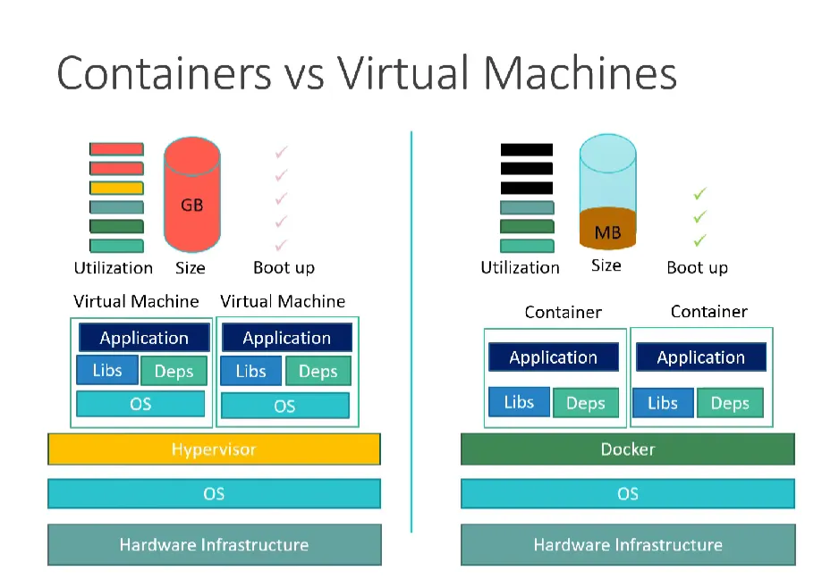
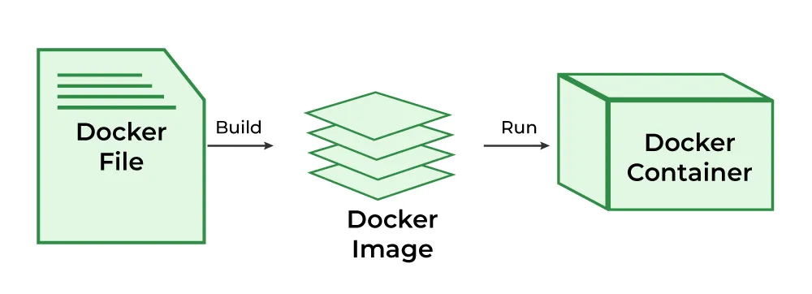

## what is the docker
Docker is an open-source software platform that enables developers to create, deploy, and manage applications in a wide variety of computing environments.

It provides a container-based virtualization system that allows developers to package their applications into isolated containers, which can then be deployed on any operating system or cloud platform.

With Docker, developers can quickly and easily create, test, and deploy applications without having to worry about compatibility issues or hardware requirements.

## Containers vs Virtual Machines
Containers and virtual machines (VMs) both provide virtualization, but in different ways. VMs include entire operating systems, making them heavier and slower to start. Containers, on the other hand, share the host system’s OS kernel and isolate only the application and its dependencies. This makes containers much lighter, more efficient in resource usage, and faster to launch than VMs. Containers offer a more streamlined, application-focused approach to virtualization compared to the broader system emulation of VMs.

## What is a Dockerfile?
A Dockerfile is a text document that has all the command line instructions needed to assemble an image. With the help of a Dockerfile, users can create an automated build that executes several command-line instructions in succession.

Docker builds images automatically by reading instructions from a Dockerfile, which is a text file that contains all commands needed to build a given image in the correct order. A Dockerfile follows a predefined format and set of instructions.

## Docker Images

A Docker image is an executable package of software that includes everything needed to run an application: code, runtime, system tools, system libraries and settings. It is lightweight and standalone. The image informs how a container should instantiate, determining which software components will run and how.

## Docker Containers

Docker Containers are running instances of Docker images. We can think of it as a virtual environment that bundles application code with all the dependencies required to run the application, so you don’t need to rely on what’s installed on the host.

# docker build: Build a Docker image from a Dockerfile.

docker build -t <image_name>:V1 <path_to_Dockerfile>